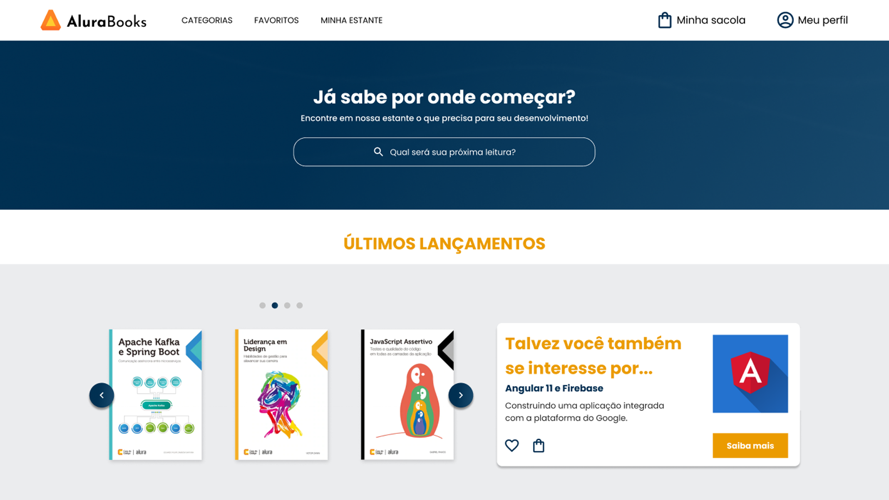

# ALURA BOOKS
> Este repositório contém um projeto de landing page para uma plataforma de livros, criado a partir de um conteúdo de aprendizado da [Alura](https://www.alura.com.br/). Ao longo do processo, apliquei conceitos essenciais que já conhecia, como mobile first e responsividade, enquanto também aprofundei e reforcei ainda mais meu entendimento.

## 📚 Materiais Ultilizados
* Design no Figma. *[Acesse aqui](https://www.figma.com/design/uVUCDvQLKvMkq2HX4C3kS1/Alura-Books?node-id=37-94&p=f&t=XFZQ4wsYHKsVn3OU-0)*
* Curso HTML e CSS: Responsividade Com Mobile-First

## 🚀 Tecnologias Utilizadas
* [HTML](https://www.w3schools.com/html/)
* [CSS](https://www.w3schools.com/Css/)

## 🔧 Requisitos
* Visual Studio Code *[Baixe aqui](https://code.visualstudio.com/)*
* Figma. *[Acesse Online ou Instale](https://www.figma.com)*